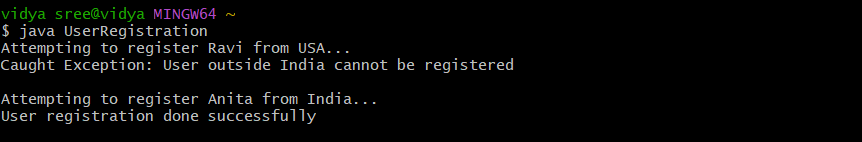

# java-lab-cse-g-5ef-7a
# experiment-7a
# # User defined exceptionn 
source code : 
```

class InvalidCountryException extends Exception {
    
    public InvalidCountryException() {
        super();
    }

  
    public InvalidCountryException(String message) {
        super(message); 
}
  
 class UserRegistration {

    
    void registerUser(String userName, String userCountry) throws InvalidCountryException {
     
        if (!userCountry.equalsIgnoreCase("India")) {
            throw new InvalidCountryException("User outside India cannot be registered");
        } else {
            
            System.out.println("User registration done successfully");
        }
    }

    public static void main(String[] args) {
        UserRegistration ur = new UserRegistration();

       
        try {
            System.out.println("Attempting to register Ravi from USA...");
            ur.registerUser("Ravi", "USA");
        } catch (InvalidCountryException e) {
           
            System.out.println("Caught Exception: " + e.getMessage());
        }

        
        try {
            System.out.println("\nAttempting to register Anita from India...");
            ur.registerUser("Anita", "India");
        } catch (InvalidCountryException e) {
            System.out.println(e.getMessage());
        }
    }
}
```
# OUTPUT: 


